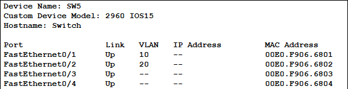
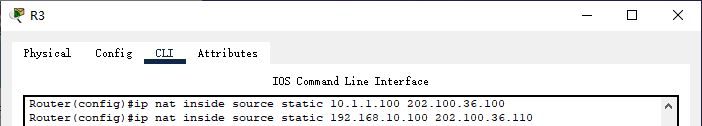
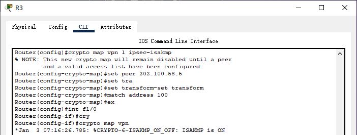

# 项目名称

企业园区网络的综合设计与安全部署

## 课程设计目的

掌握构建园区网主干常用的路由交换技术，掌握园区网常用的网络服务部署以及园区网的出口技术，并能综合运用这些技术解决实际网络建设过程中遇到的问题

## 课程设计内容

1. 某著名科技集团公司总部设在北京市，为了实现快捷的信息交流和资源共享，需要构建一个集团网络。总公司有生产和业务两个部门，要求总公司的部门既可以快速访问互联网，又可以安全地实现内部网络的通讯。
2. 总公司采用双核心的网络架构，确保集团网络主干的高可用行，同时使用路由器接入互联网。为了实现快捷的信息传递和公司业务的需求，要求内部两个部门的用户能够安全高效地访问总公司内网服务器群。同时公司的主页服务器需要在互联网上发布，提供对外的网站平台服务。
3. 方案考虑到未来3-5年的网络发展，注重网络的实用性、经济性、可靠性和可扩展性等特点。

## 项目环境要求

1. 硬件需求：路由器、二层交换机、三层交换机、服务器、PC机
2. 软件需求：Cisco Packet Tracer 8.0

## 参考网络拓扑


## IP子网规划与基础架构

按照上图的拓扑设计自行规划集团网络的基础架构，并把规划的二层/三层信息填写在下表中

| 设备类型   | 区域     | 设备名称 | 设备接口 | IP地址/VLAN ID    |
|------------|----------|----------|----------|-------------------|
| 路由器     | 公司A    | R1       | Fa0/0    | 12.1.1.1/24       |
|            |          |          | Fa0/1    | 13.1.1.1/24       |
|            |          |          | Fa1/0    | 192.168.1.2/24    |
|            |          | R2       | Fa0/0    | 24.1.1.2/24       |
|            |          |          | Fa0/1    | 12.1.1.2/24       |
|            |          | R3       | Fa0/0    | 34.1.1.3/24       |
|            |          |          | Fa0/1    | 13.1.1.3/24       |
|            |          |          | Fa1/0    | 202.100.36.3/24   |
|            |          |          | Tunnel0  | 192.168.100.1/24  |
|            |          | R4       | Fa0/0    | 10.1.1.254/24     |
|            |          |          | Fa0/1    | 24.1.1.4/24       |
|            |          |          | Fa1/0    | 34.1.1.4/24       |
|            | 公司B    | R5       | Fa0/0.10 | 172.16.10.254/24  |
|            |          |          | Fa0/0.20 | 172.16.20.254/24  |
|            |          |          | Fa0/0.30 | 172.16.30.254/24  |
|            |          |          | Fa0/1    | 202.100.58.5/24   |
|            | Internet | R6       | Fa0/0    | 202.100.36.6/24   |
|            |          |          | Fa0/1    | 202.100.69.6/24   |
|            |          |          | Se0/3/0  | 202.100.67.6/24   |
|            |          | R7       | Fa0/0    | 202.100.78.7/24   |
|            |          |          | Fa0/1    | 202.100.3.254/24  |
|            |          |          | Se0/1/0  | 202.100.67.7/24   |
|            |          | R8       | Fa0/0    | 202.100.78.8/24   |
|            |          |          | Fa0/1    | 202.100.89.8/24   |
|            |          |          | Fa1/0    | 202.100.58.8/24   |
|            |          | R9       | Fa0/0    | 202.100.69.9/24   |
|            |          |          | Fa0/1    | 202.100.89.9/24   |
|            |          |          | Fa1/0    | 202.100.109.9/24  |
|            |          | R10      | Fa0/0    | 202.100.109.10/24 |
|            |          |          | Fa0/1    | 202.100.4.254/24  |
| 2层交换机  | 公司A    | SW2      | Fa0/1    | Vlan 10           |
|            |          |          | Fa0/2    | Vlan 20           |
|            |          | SW3      | Fa0/1    | Vlan 20           |
|            |          |          | Fa0/2    | Vlan 30           |
|            |          | SW4      | Fa0/1    | Vlan 30           |
|            |          |          | Fa0/2    | Vlan 40           |
|            | 公司B    | SW5      | Fa0/1    | Vlan 10           |
|            |          |          | Fa0/2    | Vlan 20           |
|            |          | SW6      | Fa0/2    | Vlan 30           |
|            |          |          | Fa0/3    | Vlan 10           |
|            |          |          | Fa0/4    | Vlan 30           |
| 3层交换机  | 公司A    | SW1      | Fa0/4    | 192.168.1.1/24    |
| 服务器     | 公司A    | Server0  | Fa0      | 10.1.1.100/24     |
|            |          | Server4  | Fa0      | 192.168.10.1/24   |
|            | 公司B    | Server5  | Fa0      | 172.16.10.1/24    |
|            | Internet | Server1  | Fa0      | 202.100.4.200/24  |
|            |          | Server2  | Fa0      | 202.100.3.200/24  |
| PC机       | 公司A    | PC1      | Fa0      | DHCP              |
|            |          | PC2      | Fa0      | DHCP              |
|            |          | PC3      | Fa0      | DHCP              |
|            |          | PC4      | Fa0      | DHCP              |
|            |          | PC5      | Fa0      | DHCP              |
|            | 公司B    | PC6      | Fa0      | DHCP              |
|            |          | PC7      | Fa0      | DHCP              |
|            |          | PC8      | Fa0      | 172.16.30.1/24    |
|            |          | PC9      | Fa0      | 172.16.30.2/24    |

## 网络构建需求

| 序号 | 网络需求                                                                                                                                                                                                                                                                                                                                          |
|------|---------------------------------------------------------------------------------------------------------------------------------------------------------------------------------------------------------------------------------------------------------------------------------------------------------------------------------------------------|
| 1    | 按照上图所示规划VLAN和子网，所有服务器采用固定IP地址，如有规定IP地址请使用规定IP地址，如没有规定的请自行合理规划。并完成上方IP子网规划与基础架构表格。                                                                                                                                                                                            |
| 2    | 公司A,R4,R1丢失IOS，请恢复，c2800nm-advipservicesk9-mz.124-15.T1.bin,如设有enable密码，请破解密码，设置密码为cisco.                                                                                                                                                                                                                               |
| 3    | 为了预防设备IOS再次丢失，还原后请上传R4，R1.IOS到TFTP服务器，命名为YY-MM-DD-RR.bin并且把最终配置文件上传到TFPT服务器，名字修改为YY-MM-DD-RR.cfg，YYMMDD为当前时间日期,RR为路由器名称。                                                                                                                                                            |
| 4    | 公司A内部使用动态路由协议OSPF（包括3层交换机）。解决路由问题，并且控制路由走向，让公司内部的PC在访问SERVER0时的选路为：PC-SW1-R1-R2-R4-SERVER0-R4-R3-R1-SW1-PC.注意。R3不能宣告外网地址。出口路由，自行处理，此时，公司A内部全网通                                                                                                                |
| 5    | SW1,SW2,SW3,SW4，按照拓扑图划分vlan。并且使用三层交换单臂路由使得VLAN间的通信正常。每个vlan的使用192.168.XX.254作为网关IP。XX为VLAN号                                                                                                                                                                                                             |
| 6    | 公司A内部部署集中式主DHCP服务器为R1。需要向财务部，业务部，车间部，技术部下发正确的IP地址等信息。                                                                                                                                                                                                                                                 |
| 7    | 使用ACL对公司A内部网络进行控制：限制业务部和车间部和技术部对财务部的流量访问。限制R1只允许技术部进行telnet。限制车间部对SERVER0的HTTP流量。 其他流量允许。                                                                                                                                                                                        |
| 8    | 公司B内部，SW2按图划分VLAN。R5使用单臂路由使得公司B内部全网通。每个vlan的使用172.16.XX.254作为网关IP。XX为VLAN号。出口路由自行解决                                                                                                                                                                                                                |
| 9    | 由公司B的路由器R5充当DHCP服务器，财务部与车间部的PC使用DHCP获取ip，                                                                                                                                                                                                                                                                               |
| 10   | 在SW5或SW6上设置TRUNK的ALLOW，使得监控部流量不能穿越交换机。                                                                                                                                                                                                                                                                                      |
| 11   | Internet上R6.R7.R8.R9模拟Internet路由器。使用OSPF解决路由问题，通过控制选路规则似的公司A去往公司B时，实现负载均衡。                                                                                                                                                                                                                               |
| 12   | 公司A跟公司B分别运作PAT，把内部IP全部转换成路由器连接外网接口的IP地址。公司A内部服务器跟财务部服务器应提供外网访问，使用静态NAT.内部服务器转换为202.100.36.100。财务部服务器转换为202.100.36.110. 公司B财务服务器转换为202.100.58.100。 此时公司A跟公司B的所有主机应能够访问到INTERNET的服务器。 INTNERT的SERVERA能够访问到公司A跟公司B的服务器。 |
| 13   | Internet路由器R7，开启telnet功能，只允许Internet的SERVER进行远程登录。这时，公司A与公司B内部的PC应Telnet不上这台路由器。                                                                                                                                                                                                                          |
| 14   | R10使用NAT端口映射技术，把SERVER B的HTTP服务，映射成8080供其他PC访问。                                                                                                                                                                                                                                                                            |
| 15   | 使用ACL技术使得只有公司B内部的财务部的服务器和车间部可以访问SERVER B上的HTTP服务器，其他流量放行。                                                                                                                                                                                                                                                |
| 16   | 使用DNS技术，把INTERNET的下面的SERVER机器既作为HTTP服务器又作为DNS 服务器，开启DNS 服务功能设置域名对应IP的映射。把INTERNET上方的服务器映射为WWW.BAIDU.COM,把下方的服务器映射为WWW.QQ.COM,把公司A的服务器映射为WWW.GZCSNET.COM。要求其他所有机器能够使用域名打开这些服务器  |
| 17   | 使用GRE技术，使得公司A车间部和公司B车间部可以直接使用私网直接通信，其余部门间的流量都不允许，注意:分清哪些流量应该上VPN隧道，哪些流量需要走NAT访问公网，此时，公司A车间部与公司B车间之间的通信，不会影响到他们访问Internet。                                                                                                                      |
| 18   | 为了通行的安全性使用IPsec技术对GRE流量进行一个加密封装，IKE协商策略如下： 认证：预共享密钥，key为cisco123 加密：3DES 哈希：MD5 DH组：GROUP 2 密钥生存周期：86400 对感兴趣流加密策略： 使用ESP-3DS进行加密，使用ESP-MD5进行完整性校验。                                                                                                            |
| 19   | 补全拓扑图上的空缺信息，然后截图到参考网络拓扑。                                                                                                                                                                                                                                                                                                  |

## 设计过程

### 需求1

1. 设计思路

    按图表使用Cisco Packet Tracer进行设备连接，我使用了Cisco Packet Tracer 8.0，R3和R5需要使用2811，2911没有`crypto isakmp`命令，无法完成需求18，路由器缺少以太网口或串口需要自行安装模块

    各PC最终是要求使用DHCP获取地址的，但是未配置DHCP时需要做各种验证，在需要使用的PC上配置合适的IP和网关即可

### 需求2

1. 设计思路

    Server0的TFTP中有`c2800nm-advipservicesk9-mz.124-15.T1.bin`，R4和Server直连，可以通过Server0的IP地址直接恢复，R1需要在R2、R4上配置静态路由才能连接到Server0

2. 设备配置

    R4直接恢复IOS

    

    R1静态路由

    

    R2静态路由

    

    R4静态路由

    

    R1恢复IOS和R4相同，如果静态路由没配错的话

3. 结果验证

    查看flash中的文件

    ```text
    Router#show flash    
    ```

### 需求3

1. 设计思路

    备份IOS和配置文件，上传到Server0，上传之前会要求重命名，按提示输入

2. 设备配置

    R4上传IOS

    

    R4上传配置文件

    

    R1上传也是一样的

3. 结果验证

    查看Server0的TFTP文件，有图形化界面

    

### 需求4

1. 设计思路

    在A公司所有路由器和三层交换机中使用OSPF协议，在R3配置OSPF时不要宣告`202.100.36.0/24`网段，在R1和R4上修改cost就可以控制上下行流量走不同路径

2. 设备配置

    SW1配置OSPF

    

    R1配置OSPF，R2、R3、R4进行相同的配置，R3不要宣告`202.100.36.0/24`网段

    将R4、R1的G0/1端口cost调节为10

    

3. 结果验证

    在任一PC和Server0的终端上运行`tracert`命令即可

### 需求5

1. 设计思路

    在SW2、SW3、SW4上都添加VLAN10、20、30、40，按设备划分VLAN，和三层交换机连接的端口设置为Trunk端口，为三层交换机的VLAN设置IP。

2. 设备配置

    二层交换机和PC的配置使用图形界面完成

    SW1启用路由功能，先添加VLAN10、20、30、40，再将G1/0/1、G1/0/2、G1/0/3设置为Trunk端口，最后进行如下配置

    

3. 结果验证

    使用不同VLAN下的PC互相`ping`即可

### 需求6

1. 设计思路

    先排除网关IP，再为四个部门的子网配置DHCP地址池，因为终端设备与R1不在同一个广播域，所以要在SW1上为每个VLAN配置DHCP中继。

2. 设备配置

    排除端口

    

    配置DHCP

    

    配置DHCP中继

    

    将相关终端的IP获取方式全部设置为DHCP

3. 结果验证

    各终端设置DHCP获取IP，稍作等待即可获取正确的IP和网关

### 需求7

1. 设计思路

    在SW1上配置标准ACL，阻止其他部门的子网流量进入VLAN10接口。为R1配置Telnet服务，并为Telnet服务启用ACL。在SW1上配置扩展ACL，禁止车间部网段对Server0的HTTP流量

2. 设备配置

    在SW1上配置标准ACL，限制其他部门访问财务部

    

    在R1上配置Telnet服务,Telnet密码和enable密码都是1111

    

    在R1上配置ACL，只允许技术部网段的Telnet请求

    

    在SW1上配置扩展ACL，禁止车间到Server0的HTTP流量

    

3. 结果验证

    使用其他部门PC对财务部的PC进行`ping`操作

    技术部PC对R1进行Telnet，终端中使用

    ```text
    telnet 192.168.1.2
    ```

    模拟器也提供了图形界面，其他部门无法对R1进行Telnet，测试方式相同

    其他部门访问Server0的HTTP服务正常

    

    车间部访问Server0的HTTP服务超时，但是可以`ping`服务器

    

### 需求8

1. 设计思路

    经典的单臂路由，在SW5、SW6上划分VLAN，并在R5的F0/0接口上配置三个子接口`G0/0.10`、`.20`、`.30`，封装3个VLAN，并配置IP

2. 设备配置

    SW5的F0/3、F0/4配置为trunk端口

    

    SW6的F0/1配置为trunk端口

    

    单臂路由配置

    

3. 结果验证

    查看R5端口配置

    

    验证单臂路由需要在不同VLAN的终端上互相`ping`

### 需求9

1. 设计思路

    和需求6一样，财务部和车间部的PC分别属于`172.16.10.0/24`和`172.16.20.0/24`子网，先排除子端口的IP，再为以上两个子网配置两个DHCP地址池

2. 设备配置

    排除端口

    配置子网172.16.10.0/24 DHCP

    配置子网172.16.20.0/24 DHCP

3. 结果验证

    查看DHCP池

    ```text
    Router#show ip shcp pool
    ```

    查看PC6、PC7通过DHCP获取到IP和网关即可

### 需求10

1. 设计思路

    在SW6上配置trunk端口，即Fa0/1，不允许VLAN30的流量通过

2. 设备配置

    图形界面也可以配置，更加方便

    

3. 结果验证

    PC9和其他设备无法连通，自行进行`ping`测试

### 需求11

1. 设计思路

    在R6,R7,R8,R9上面配置OSPF，area号为2，包括连接A，B公司的边界端口，即R6的G0/0,R8的G1/0也加入OSPF

    A公司和B公司通信时，必须要经过R3和R6，R3和R6的OSPF不在同一个区域，R3作为连接外网的设备，需要设置默认路由为R6，R5需要设置默认路由为R8

    串口的cost值远大于快速以太网口的cost值，即来自A的数据去往B则只会通过以太网口，要想实现负载均衡，可以将R6的G0/1口的cost值调至与s0/3/0一致。

2. 设备配置

    配置OSPF参考需求4，R6、R7、R8、R9配置OSPF，area号自行设置，这里设置为2，将所有连接的网段加入OSPF

    R3配置默认路由

    

    R5配置静态路由

    

    查看R6串口的cost，并修改G0/1的cost

    

    

3. 结果验证

    查看R6路由表，去往B公司的流量也会通串口发送

    ```text
    Router#show ip route ospf
    ```

### 需求12

1. 设计思路

    将R3的F0/0和F0/1设置为内部端口，F1/0设置为外部端口，将A公司的主机和服务器均添加到访问列表10中，新建一个地址池，命名为a，范围为`202.100.36.100~110`，关联访问列表10和地址池a

    将内网的服务器和财务部地址用静态NAT分别映射到`202.100.36.100`和`202.100.36.110`以供外网访问。为了使得A公司内主机能够访问外网，还需要设置R4、R1、SW1的默认路由，以正确控制发向外部的路径

2. 设备配置

    R3端口设置

    

    R3配置PAT，overload表示启用PAT

    

    将财务部Server4的IP设置为`192.168.10.100`

    R3配置静态NAT

    

    R4配置默认路由

    `0.0.0.0/0 via 34.1.1.3`

    R1配置默认路由

    `0.0.0.0/0 via 13.1.1.3`

    SW1配置默认路由

    `0.0.0.0/0 via 192.168.1.2`

    R5端口设置，分别为子端口配置

    

    R5配置动态和静态NAT

    

3. 结果验证

    Server2使用外网地址`ping`公司B的Server

    在公司B的PC上`ping`Server2

### 需求13

1. 设计思路

    和需求7一样，开启R7的Telnet服务，并为Telnet服务启用ACL，只允许Server2进行Telnet

2. 设备配置

    启用Telnet服务

    为Telnet服务配置ACL

3. 结果验证

    在Server2上使用Telnet连接R7

### 需求14

1. 设计思路

    先在R10上配置OSPF，再配置NAT服务，Fa0/1为内部端口，Fa0/0为外部端口

2. 设备配置

    和需求11一样，R10配置OSPF，area号要和Internet部分相同

    配置静态NAT，将80映射到8080

    

3. 结果验证

    

### 需求15

1. 设计思路

    在R5上配置ACL

2. 设备配置

    

3. 结果验证

    在Web Browser中访问`202.100.4.200:8080`

    财务部服务器访问成功、车间部PC访问成功、财务部PC访问超时

### 需求16

1. 设计思路

    在Server1上配置DNS，在使用静态IP的终端设备上设置DNS地址，并在R5上添加DNS中继

    公司A内网的机器不能直接使用公共DNS，内网PC无法使用NAT地址访问内网服务器，需要在内部的Server0上搭建DNS，并在R1上添加DNS中继

2. 设备配置

    Server1配置DNS

    

    R5配置DNS中继

    

    Server0配置DNS

    

    R1配置DNS中继

    

3. 结果验证

    在A、B公司的PC上使用域名对各个服务器进行访问

### 需求17

1. 设计思路

    配置GRE，R3的地址为192.168.100.1，R5的地址为192.168.100.2

2. 设备配置

    R3配置GRE

    

    R3配置静态路由

    

    R5配置GRE

    

    R5配置静态路由

    

3. 结果验证

    公司A车间部和公司B车间部之间`tracert`，可以看到ICMP包会经过`192.168.100.0/24`网段

    在模拟模式下抓包，可以看到GRE

    

### 需求18

1. 设计思路

    在R3和R5上配置各个策略，并在出口上应用map

2. 设备配置

    配置R3上的IKE，预共享密钥，使用3DES加密，Hash方式为MD5

    

    定义名为transform的策略，使用esp-3des加密，验证算法为esp-md5-hmac，设置要加密的数据的为A公司车间和B公司车间之间的数据

    

    定义map并在出接口上应用

    

    配置R5

    

3. 结果验证

    查看R3配置

    

    查看R5配置

    
